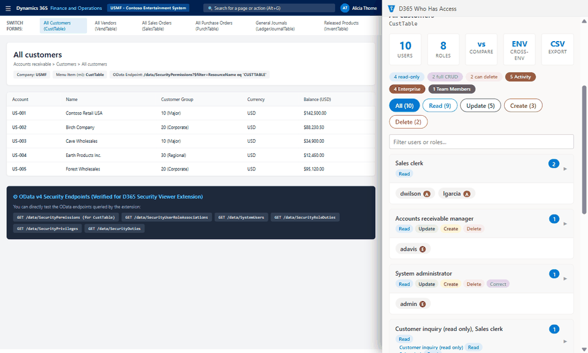

# D365 Who Has Access

Chrome extension for Dynamics 365 finance and operations security. Open any D365 F&O page, click the extension, and the side panel shows every role and every user with access to that form, with the exact access level and how Deny overrides Grant.

[Install from the Chrome Web Store](https://chromewebstore.google.com/detail/d365-who-has-access/gdfkikjpnmjoachieedlfmbhonaonfjn)

## What it does

- **Who has access:** every role and user for the current menu item, grouped by role combination, with the license tier each user pulls in.
- **Narrowest role:** paste menu items and get the role that covers them with the least extra access, plus the duties and privileges behind it.
- **What role to assign:** enter user IDs and see who already has access and the smallest role that closes the gap for the rest.
- **Inspect and compare roles:** side by side, with Grant/Deny conflicts called out.
- **Security and license overview:** enabled, disabled and external users, role assignments, and effective license tier per user.
- **User x permission inventory** with CSV export.
- **Cross-environment compare:** the same user and menu item in two environments (for example UAT and production).

## Works with

- Microsoft commercial cloud (`*.dynamics.com`), US Government GCC, GCC High and DoD (`*.microsoftdynamics.us`) and China (`*.dynamics.cn`).
- On-premises or custom domains: click "Allow access" once for that site.

## Privacy

Uses your existing D365 sign-in and calls your own environment's OData endpoint. You only see what your account can read (System administrator or Security administrator is needed for security permissions). Nothing leaves your browser: no analytics, no tracking, no remote code, no accounts. See [store/PRIVACY.md](store/PRIVACY.md).

## Run from source

1. Clone this repo.
2. Open `chrome://extensions`, turn on Developer mode, click **Load unpacked** and pick the repo folder.
3. Open a D365 F&O page and click the extension icon.

`build.ps1` produces the store zip in `dist/` (it strips the localhost dev hosts). `demo/` runs the real popup and background scripts against a fictional Contoso dataset with a mocked OData endpoint, which is how the screenshots are made.

## Known issue

"Narrowest duty" is arbitrary for now: `findNarrowestRole` does not fill duty privileges yet. PRs welcome.

## License

MIT. Dynamics 365 is a trademark of Microsoft. This project is not affiliated with or endorsed by Microsoft.
